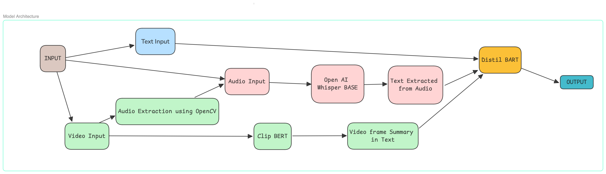

# Multi-Modal Content Summarization System

## Introduction

The Multi-Modal Content Summarization System is an AI-driven solution designed to improve information consumption by generating concise and coherent summaries from various content formats, including text, audio, and video. Rather than reinventing the wheel we have used pretrained proven models to summarize the information.

## Objectives

- Develop a multi-modal language model that enhances content consumption.
- Provide summarized outputs from text, audio, and video inputs.
- Offer personalized and engaging content summaries to users.

## Problem Statement

With the overwhelming volume of online content, users struggle to consume information efficiently. Current solutions often lack the capability to handle multiple input formats or adapt dynamically to user preferences. This system aims to fill that gap by providing concise and personalized summaries from various input types, including text, audio, and video.

## Proposed Solution

The system integrates pretrained models to process different input formats and generate meaningful, summarized content. It allows users to input information in text, audio, or video formats and receive coherent and concise outputs. The following flowchart illustrates the architecture of the solution, highlighting the key components and their interactions.

## System Architecture

### 1. Input Layer

- **Text Input:** Accepts text files (.txt, .pdf, .docx) for summarization.
- **Audio Input:** Utilizes Open AI Whisper BASE for converting audio files into text.
- **Video Input:** Uses OpenCV to extract audio from video files and Clip BERT to generate textual summaries of video frames.

### 2. Processing Layer

- **Open AI Whisper BASE:** Transcribes audio input into text, offering real-time performance and multilingual support.
- **Clip BERT:** Generates descriptive text summaries from video frames for better video content understanding.
- **Audio Extraction using OpenCV:** Extracts audio from video inputs to process it through Whisper BASE.

### 3. Text Integration

- **Text Extracted from Audio:** Converts audio to text using Whisper BASE, enabling consistent text-based processing.
- **Video Frame Summary in Text:** Processes video frames into text using Clip BERT for uniform handling of video inputs.

### 4. Summarization Layer

- **Distil BART:** A lightweight version of BART for text summarization, combining various input texts into a concise summary.

### 5. Output Layer

- **Output:** Presents the final summarized content, adaptable for applications like educational materials, news briefings, and entertainment.

## Technologies Used

- **Open AI Whisper BASE:** Speech-to-text engine for accurate audio transcription.
- **Clip BERT:** Pre-trained model for generating text summaries from video frames.
- **OpenCV:** Library for video processing and audio extraction.
- **Distil BART:** Lightweight model for efficient text summarization.

For personalization, we can adjust the summarization ratio or the max number of characters for summarization according to the user's preferance.

## Demo Video

[Demo Video](https://drive.google.com/file/d/1PO27e7SrSF0zJEnfnl9YqR_HOC1FZ2o8/view?usp=sharing)

## Conclusion

This system provides a powerful method for consuming content across different formats. By employing Whisper BASE, OpenCV, Clip BERT, and Distil BART, users can access accurate, personalized, and concise information. This solution enhances the user experience, making it easier to stay informed, learn, and be entertained in a world overflowing with digital content.

## Getting Started

To use this system, follow the steps below:

1. Clone the repository: `git clone https://github.com/your-username/multimodal-summarization.git`
2. Navigate to the project directory: `cd multimodal-summarization`
3. Install the required dependencies: `pip install -r requirements.txt`
4. Run the system: `python main.py --text path_to_text_file`. For audio and video you can use `--audio` or `--video` arguments.
5. Upload your input files (text, audio, or video) and receive the summarized output.

Or, the python notebook can be run directly `Summarize.ipynb`.

## License

This project is licensed under the MIT License. See the [LICENSE](LICENSE) file for more details.

## Contributing

We welcome contributions from the community! Please read our [CONTRIBUTING.md](CONTRIBUTING.md) file for guidelines on how to contribute to this project.

## Contact

For questions or feedback, please contact [saikirancvn@gmail.com](mailto:saikirancvn@gmail.com).
